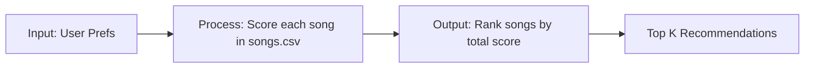

# 🎵 Music Recommender Simulation

## Project Summary

In this project you will build and explain a small music recommender system.

Your goal is to:

- Represent songs and a user "taste profile" as data
- Design a scoring rule that turns that data into recommendations
- Evaluate what your system gets right and wrong
- Reflect on how this mirrors real world AI recommenders

Replace this paragraph with your own summary of what your version does.

---

## How The System Works

Explain your design in plain language.

Some prompts to answer:

- What features does each `Song` use in your system
  - For example: genre, mood, energy, tempo
- What information does your `UserProfile` store
- How does your `Recommender` compute a score for each song
- How do you choose which songs to recommend

You can include a simple diagram or bullet list if helpful.

In real-world recommender systems, platforms predict what you will like next by combining signals from your past choices with patterns from similar users and item attributes. My version will focus on a simple content-based approach: it will compare each song’s features against a user profile, reward close matches, and rank songs by the total score so the closest matches appear first.

This simulation will use these specific features:

- `Song`: `genre`, `mood`, `energy`, `tempo_bpm`, `valence`, `danceability`, `acousticness`
- `UserProfile`: `favorite_genre`, `favorite_mood`, `target_energy`, `likes_acoustic`

Algorithm Recipe:

- `+2.0` points for a genre match
- `+1.0` point for a mood match
- Energy similarity points based on how close the song’s `energy` is to the user’s `target_energy`
- Optional tie-breakers can use other features like `acousticness`, but only after the core score is calculated

Data flow:



This design gives genre the strongest exact-match boost, mood a smaller but still meaningful boost, and energy a flexible similarity score so songs can rank well even when they are not exact matches. Mood matters less than genre in the raw points, but it still helps capture the user’s vibe when the genre is broad or only loosely related.

Possible biases:

- The system may over-prioritize genre and miss songs that better match the user’s mood.
- Exact-match scoring can create ties when many songs share the same labels.
- With a small catalog, one unusual or mislabeled song can shift the ranking more than it would in a larger dataset.
- If energy similarity is weighted too heavily, the recommender may favor songs that feel similar but do not match the user’s style.

---

## Getting Started

### Setup

1. Create a virtual environment (optional but recommended):

   ```bash
   python -m venv .venv
   source .venv/bin/activate      # Mac or Linux
   .venv\Scripts\activate         # Windows

2. Install dependencies

```bash
pip install -r requirements.txt
```

3. Run the app:

```bash
python -m src.main
```

### Running Tests

Run the starter tests with:

```bash
pytest
```

You can add more tests in `tests/test_recommender.py`.

---

## Sample Recommendation Output

Paste a sample of your recommender's output here as a text block so a reader can see what it produces:

```
Loaded songs: 10

Top recommendations (profile: genre=pop, mood=happy, energy=0.8)
------------------------------------------------------------------------
1. Sunrise City
  Score  : 3.98
  Reasons: genre match (+2.0); mood match (+1.0); energy similarity (+0.98)
------------------------------------------------------------------------
2. Gym Hero
  Score  : 2.87
  Reasons: genre match (+2.0); mood mismatch (intense); energy similarity (+0.87)
------------------------------------------------------------------------
3. Rooftop Lights
  Score  : 1.96
  Reasons: genre mismatch (indie pop); mood match (+1.0); energy similarity (+0.96)
------------------------------------------------------------------------
4. Night Drive Loop
  Score  : 0.95
  Reasons: genre mismatch (synthwave); mood mismatch (moody); energy similarity (+0.95)
------------------------------------------------------------------------
5. Storm Runner
  Score  : 0.89
  Reasons: genre mismatch (rock); mood mismatch (intense); energy similarity (+0.89)
------------------------------------------------------------------------
```

**Screenshot or video** *(optional)*: <!-- Insert a screenshot or demo video link here -->

---

## Experiments You Tried

Use this section to document the experiments you ran. For example:

- What happened when you changed the weight on genre from 2.0 to 0.5
- What happened when you added tempo or valence to the score
- How did your system behave for different types of users

---

## Limitations and Risks

Summarize some limitations of your recommender.

Examples:

- It only works on a tiny catalog
- It does not understand lyrics or language
- It might over favor one genre or mood

You will go deeper on this in your model card.

---

## Reflection

Read and complete `model_card.md`:

[**Model Card**](model_card.md)

Write 1 to 2 paragraphs here about what you learned:

- about how recommenders turn data into predictions
- about where bias or unfairness could show up in systems like this


